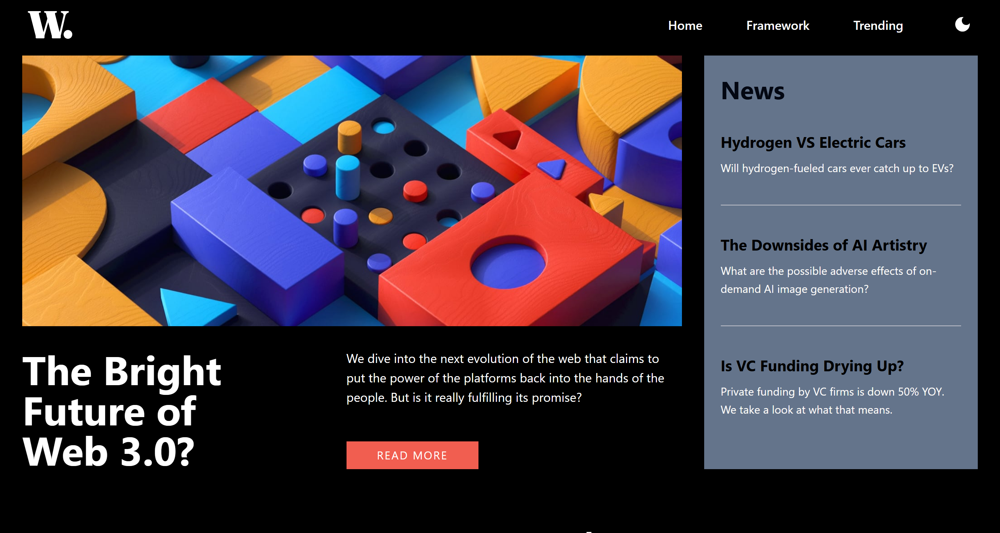
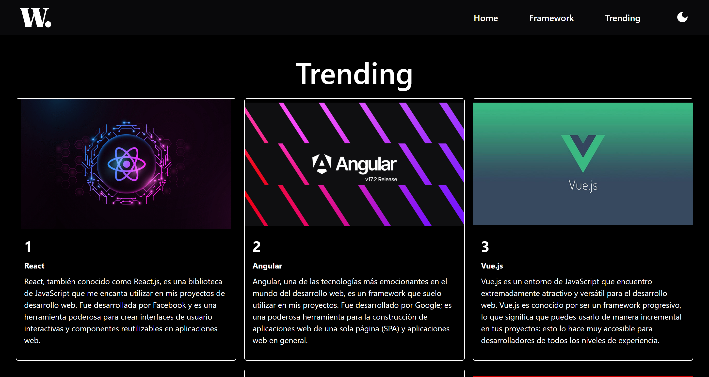
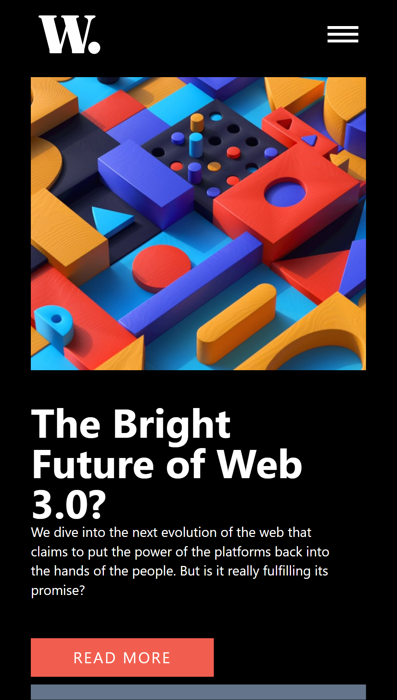
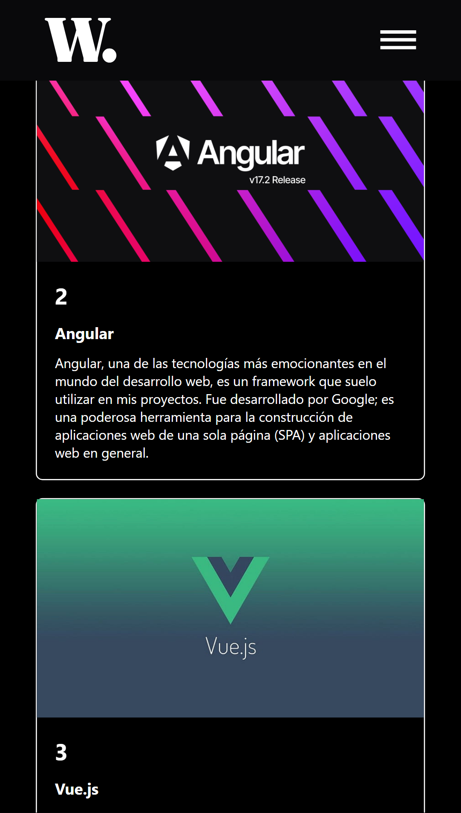

## 🚀 Como ejecutarlo en local

Tener acceso a una terminal para seguir los siguientes pasos:

>

1. Necesitamos clonar el proyecto añadiendo la siguiente linea de comando en una terminal

```
git clone https://github.com/DiegoRMV/homepage-vite-tailwind.git
```

> 2. Entramos a la carpeta que acabamos de clonar e instalamos las dependencias necesarias

```
npm i o npm install

```

> 3. Ejecutamos nuestro proyecto en local

```
npm run dev

```

💻 En computadora

> 
> 

📱 En móvil

>


